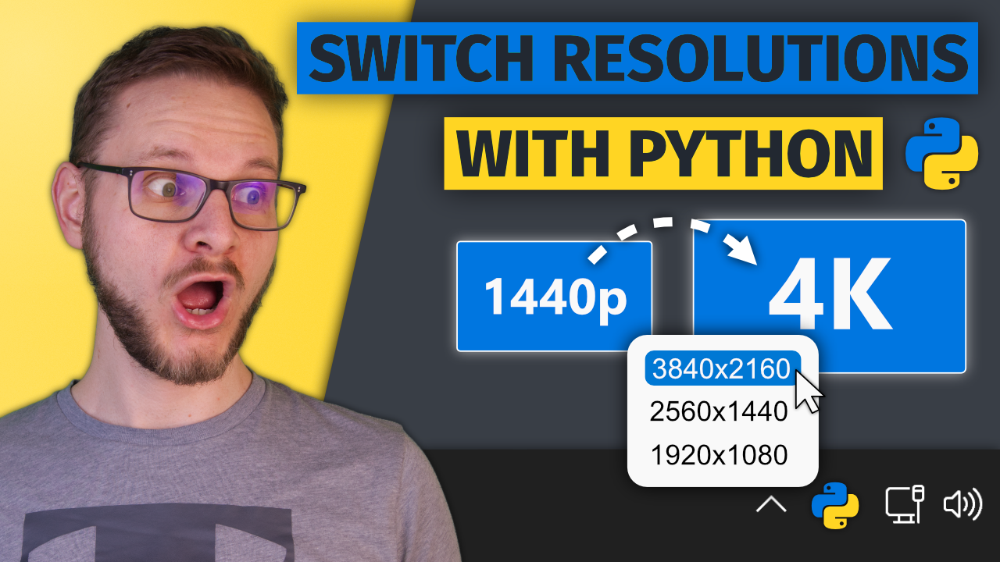
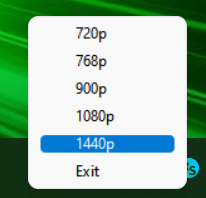
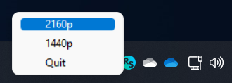

# Windows Resolution Switcher

This short Python script allows you to easily switch the resolution of your main monitor from the Windows 10/11 system tray.

## Setup Video

[Youtube Video Link](https://youtu.be/Vrg4RhjxztE)

[![`[YouTube]`](https://img.shields.io/badge/-k0nze%20builds-ff0000?logo=youtube&logoColor=white)](https://www.youtube.com/channel/UC3_SywgWxpEBIoKawK2E3MA)
[![`[Twitter]`](https://img.shields.io/badge/-@k0nze_-1DA1F2?logo=twitter&logoColor=white)](https://twitter.com/k0nze_)
[![`[Discord]`](https://img.shields.io/discord/713121297407672380.svg?label=&logo=discord&logoColor=ffffff&color=7389D8&labelColor=6A7EC2)](https://discord.k0nze.gg)
[![`[Patreon]`](https://img.shields.io/badge/-Patreon-f96854?logo=patreon&logoColor=white)](https://patreon.com/k0nze)
[![`[LinkedIn]`](https://img.shields.io/badge/LinkedIn-blue?style=flat&logo=linkedin&labelColor=blue)](https://www.linkedin.com/in/konstantin-luebeck/)

## Prerequisits

* Windows 10 or 11
* Python Version >= 3.9

## Setup

 1. Download or clone the repository.
 2. Setup a virtual environment inside of the repository: `python -m venv .venv`
 3. Activate the environment: `.\.venv\Scripts\activate`
 4. Install the required Python packages: `python -m pip install -r requirements.txt`
 5. Add your Resolutions: In the file [resolution_switcher.py](./resolution_switcher.py) you find the `menu` tuple and it's `item`s. Here you can add your custom resolution by either adding another `item` or editing the existing ones that call `on_set_resolution(width, height)`.
 6. Change the path to the repository in [resolution_switcher.bat](resolution_switcher.bat). The path after the `cd` command enclosed by `"` has to be changed to the path of this repository on your computer.
 8. Check if it works by double-clicking on [resolution_switcher.vbs](./resolution_switcher.vbs) and right-clicking on the **RS** icon in the system tray.
 9. Create a shortcut for [resolution_switcher.vbs](./resolution_switcher.vbs)
 10. Add the shortcut to the Windows startup: Press **Win+R** and enter `shell:startup` and move the created shortcut into the newly opened folder in the Explorer.
 11. Reboot your computer and login. You should now see the Resolution Switcher icon in the system tray.
